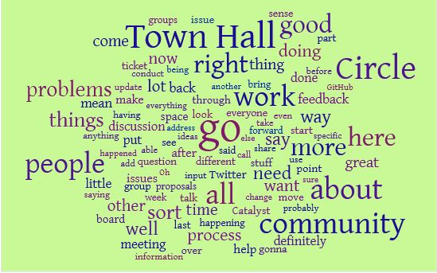

# Meeting #5 April 28th 2022

## Meeting recording



## Minutes of Catalyst Circle v3 Meeting #5

### Present (in order of first speaking) 

**Nori Nishigaya** (facilitator); **Joey Chessher** (Toolmakers and Maintainers); **Dimitri Fernando** (General ADA Holders); **Bullish Dumpling** (Cardano Foundation**); Mercy A** (Funded Proposers**); Rhys Morgan** (stakepool operators); **Nadia Hopkins** (Community Advisors**); Harris Warren** (IOG); **JP** (secretary).

### Speaker percentages

**Nadia** (23%), **Harris** (19%), **Rhys** (16%), **Nori** (15%), **Joey** (9%), **Mercy** (8%), **Dimitri** (4%), **Dumpling** (3%), **JP** (1%)

### Abbreviations used/Glossary

API – Application Programming Interface (a software intermediary that allows two applications to talk to each other)

ATH – After Townhall, breakout rooms after the regular Wednesday [TownHall meeting](https://bit.ly/3rCicSR)

CA – Community Advisor, a role open to anyone in Catalyst, to assess proposals in each funding round

CC – Catalyst Circle

CF – [Cardano Foundation](https://cardanofoundation.org)

CTC, Catalyst Technical Council,  a proposed body that will be appointed by IOG to be involved in [bicameral](https://en.wikipedia.org/wiki/Bicameralism) governance alongside the Catalyst community.

Catalyst School – [https://thecatalyst.school](https://thecatalyst.school)

d-Rep – delegation representative, a proposed new role; people to whom a voter will be able to delegate their voting power. See the [registration form](https://docs.google.com/forms/d/e/1FAIpQLSfPSb\_cDlIxN6cnnbOrJN\_oxDBmxB3kENbsE\_\_pmMAw8yJk0w/viewform)

DID – [Decentralised identifiers](https://en.wikipedia.org/wiki/Decentralized\_identifiers)

ETH – [Eastern Town Hall](https://www.youtube.com/channel/UCV2lFD4AtGRT-WIrLoX58lg)

Gimbalabs - [https://gimbalabs.com/gimbalgrid](https://gimbalabs.com/gimbalgrid)

IOG – [Input/Output Global](https://iohk.io)

NFT – [non-fungible token](https://en.wikipedia.org/wiki/Non-fungible\_token)

QA-DAO –  [Quality Assurance Distributed Autonomous Organisation](https://quality-assurance-dao.github.io)

SPO – stakepool operator

VCA – Veteran Community Advisor, a Catalyst role open to those who have been a CA in previous rounds, to assess the CAs’ reviews

Voltaire – the next phase on the [Cardano roadmap to decentralisation](https://roadmap.cardano.org/en/voltaire/)

## 1. Opening, agenda (0:00)

Check-in **(0:02)**\
Agenda and align expectations **(4:19)** – 2 similar agenda items merged&#x20;

## 2. Circle stand-up (6:36)

**Nori (6:36)** explains the [Prioritised Problems GitHub board](https://github.com/orgs/Catalyst-Circle/projects/8/views/1)

### **Unassigned cards (6:50)**

[Community outreach reporting and KPIs](https://github.com/Catalyst-Circle/Catalyst-Prioritized-Problems/issues/91) – to be discussed later in this meeting

[Faster funding for Catalyst projects](https://github.com/Catalyst-Circle/Catalyst-Prioritized-Problems/issues/52) – at the last meeting, Circle agreed to discuss offline to check everyone is OK with the final status of this ticket; it has been agreed that it is moved to “Circle sign-off”.

### **Mercy (08:20)**

* On [Treasury to support admin, governance and community projects to become sustainable](https://github.com/Catalyst-Circle/Catalyst-Prioritized-Problems/issues/77), deferred to Harris. _(**Oversight note:** Harris did not address this card in his stand-up, either this meeting or last meeting.)_
* On [exact timing of release of funds](https://github.com/Catalyst-Circle/Catalyst-Prioritized-Problems/issues/75), Danny and Marek are finalising the details; then we will communicate it to the community, including a reminder of Funded Proposers’ responsibilities on reporting.
* Future: Sub-circle are working on problem-sensing – once problems are framed, will bring them to the prioritised problems board.
* No blockers, except Danny and Marek’s work schedule, particularly at voting time.

### **Nadia (11:46)**

* &#x20;[CA/vCA Community Needs to Prioritize and Solve F8 Sensed Issues for Fund 9](https://github.com/Catalyst-Circle/Catalyst-Prioritized-Problems/issues/87) – moved from “backlog” to “shared with community” –  to be discussed later in this meeting
* On [proposer group and the proposal process itself lack official representation for issue solving](https://github.com/Catalyst-Circle/Catalyst-Prioritized-Problems/issues/88) – may need discussion outside meeting. Move to “Raw problems”.
* On [Method for selecting Technical Council](https://github.com/Catalyst-Circle/Catalyst-Prioritized-Problems/issues/59) – no progress yet – leave in “backlog”
* On [Review and revise the prioritised problems workflow](https://github.com/Catalyst-Circle/Catalyst-Prioritized-Problems/issues/86), - Joey also owns this; to be discussed later in the meeting. Move to “researching”.
* No blockers; but a request for help from the team, which is on the agenda later.

**Mercy (15:10**) Assigned as co-owner of [proposer group and the proposal process itself lack official representation for issue solving](https://github.com/Catalyst-Circle/Catalyst-Prioritized-Problems/issues/88) because FP sub-circle are doing some work on it. Harris also assigned co-owner. Next step – Mercy, Harris Nadia and any other interested Circle members to meet and look at what problems have been sensed, any recommendations from FP sub-circle, etc.

**Harris (16:16)** Recommend actually opening cards in the meeting and adding notes on actions and decisions to them as we talk. (Agreed)

**Nadia (17:45):** the reason I own [proposer group and the proposal process itself lack official representation for issue solving](https://github.com/Catalyst-Circle/Catalyst-Prioritized-Problems/issues/88) is that it has affected the CA process in fund 8 and CAs have noticed problems related to it, but it is not the CA group’s sphere of influence. So we want to contribute to it, but have more of a collective discussion.

### **Dimitri (18:50)**

* Same as last meeting, I spent last 2 weeks in various Twitter spaces talking about ADA holders’ role and Circle role, correcting misconceptions. Usually at night or early morning in my time zone.
* On [anti-scammers initiative on social media](https://github.com/Catalyst-Circle/Catalyst-Prioritized-Problems/issues/45), I put it to the general public but had no response or comments; nobody is interested in the issue. Decision: card moved back to “backlog” and Dimitri removed as owner since no active work is being done.
* No blockers.

**Joey (21:32)** There have been several proposals addressing  [anti-scammers initiative on social media](https://github.com/Catalyst-Circle/Catalyst-Prioritized-Problems/issues/45); could begin to address in future by looking at them.

**Nori (24:02)** Add a card about misconceptions about Circle’s role, so we can track what is being done. All reps to ask their individual communities for input.

<mark style="color:red;">**ACTION POINT**</mark><mark style="color:red;">:</mark> Dimitri to add a card to the board for this.

_**Oversight note**: In the last meeting, Dimitri, Joey and Rhys were to form a working party to progress_ [_Nurturing a listening culture_](https://github.com/Catalyst-Circle/Catalyst-Prioritized-Problems/issues/69) _No progress mentioned on this._

### **Harris (28:08)**

* On [Define the process for CCv4 elections](https://github.com/Catalyst-Circle/Catalyst-Prioritized-Problems/issues/89) - need a working session to address, perhaps next week’s Thursday meeting.
* On [Improve awareness of project Catalyst](https://github.com/Catalyst-Circle/Catalyst-Prioritized-Problems/issues/49) – at this year’s [Consensus](https://www.coindesk.com/consensus2022/) conference, Charles Hoskinson is speaking, there may be opportunities to talk about Catalyst. Harris will attend. Other similar opportunities, Harris to update next meeting.
* On [Initiating a code of conduct for Circle](https://github.com/Catalyst-Circle/Catalyst-Prioritized-Problems/issues/83) – we created a [WikiSurvey](https://pol.is/5xuvbiv25u) on Pol.is which generated several feedback points; but no other progress, and no ATH has been held yet. Would like support from Circle, and from IOG Legal to progress this. ATH to be discussed later in this meeting.
* On [how to remove IOG from every decision](https://github.com/Catalyst-Circle/Catalyst-Prioritized-Problems/issues/47) – this is stalled currently.
* On [Lack of onboarding structures](https://github.com/Catalyst-Circle/Catalyst-Prioritized-Problems/issues/56) – I think there is some work that’s being done, I haven’t explicitly tracked it.
* On [developing governance and developer ecosystem](https://github.com/Catalyst-Circle/Catalyst-Prioritized-Problems/issues/51) there is ongoing discussion re: better coordination with developers and more open-source approaches; will be sharing more details soon.
* Future: Will try to focus on a couple of areas and do more to participate in moving cards forward; this proves Circle is doing some work.
* No blockers.

**Rhys (33:11)** On [Lack of onboarding structures](https://github.com/Catalyst-Circle/Catalyst-Prioritized-Problems/issues/56) I have been working with Tevo and with Catalyst School, have a meeting tomorrow to progress ideas.

### **Joey (34:41)**

* Have looked at and analysed past Circle documentation; noticed the evolution from one Circle to next. Although we (Toolmakers in CCv3) have a lot of activities, we don’t have many prioritised problems on the board compared to previous Circles, and there is not one particular activity that T\&M has ownership of.
* Amazing how much the community’s activity and communications expanded due to the work of Circle v1 and v2. ATH, Discord, and the levels of collaboration in the community now, all demonstrate Circle’s work.
* Also looked at proposals addressing prioritised problems – for example on [Systems to track trust and participation](https://github.com/Catalyst-Circle/Catalyst-Prioritized-Problems/issues/37) alone there are 28 proposals. The community is not waiting for us – they are moving forward to address problems, and they are doing this mainly via proposals.
* The reason that some problems are owned by T\&M is that during CCv1 and CCv2 the T\&M reps (Felix and Tevo) were not only problem-sensing, but doing hands-on work via Swarm, Catalyst School, Gimbalabs, engaging the community beyond Circle, so the work continued independently of Circle.
* Once a proposal is made to address a problem, and is completed, how is it integrated? IOG has the final say on what is integrated into the community. Harris has done some productive work on this.
* No blockers.

**Nori (39:44)** If some of the older problems from CCv1 and CCv2 are finished, you could add comments to the card based on your research and analysis of what was done; then we can discuss it briefly at a meeting and decide to close the card.\
**Joey (41:07)** I will; but several of them will never be completely finished and closed out, e.g. [Nurturing a listening culture](https://github.com/Catalyst-Circle/Catalyst-Prioritized-Problems/issues/69) will always be ongoing.\
**Nori (41:25)** We need measurable outcomes; but it may not be 100% solved.

<mark style="color:red;">**ACTION ITEM:**</mark> Joey to populate cards with information on what progress has been made across CCv1, v2 and v3 towards solving, especially links to proposals that address the problem.

**Nadia (42:37)** It’s good for all of us to detail in our cards what we did, and what we learned, as a way of archiving that information.

**Harris (44:01)** We could write an “end-of-Circle” closeout report, to share with the community, on what we actually accomplished.

### **Dumpling (47:22)**

* I only have one card, the [communications gap](https://github.com/Catalyst-Circle/Catalyst-Prioritized-Problems/issues/78). Held a Twitter Space about Circle last week – Rhys, Mercy, Nadia, Dimitri, JP were present. Suggestions from it included a cross-platform outreach plan to improve awareness of Circle.
* Another issue raised was – is Circle useful if it is only able to sense problems, and has no authority to change things?
* Future: I want to explore doing Twitter spaces with the community regularly; an open platform for people to raise problems with their respective reps. &#x20;
* No blockers.                                                                                                     &#x20;

### **Rhys (51:05)**

* On [Nurturing a listening culture](https://github.com/Catalyst-Circle/Catalyst-Prioritized-Problems/issues/69)  - as we have all said, it’s ongoing.&#x20;
* [On Community outreach reporting and KPIs](https://github.com/Catalyst-Circle/Catalyst-Prioritized-Problems/issues/91) – important to discuss today, and come back to the community with ways to explain what we do, with some metrics they can check.
* On [Lack of permanent Miscellaneous challenge](https://github.com/Catalyst-Circle/Catalyst-Prioritized-Problems/issues/55) – with Felix and Lauris, have set up the “SPO Guild” to organise and bring SPOs together, and will discuss how to champion a fund 10 Challenge setting focused on SPOs .
* On [Involve SPOs in Catalyst projects](https://github.com/Catalyst-Circle/Catalyst-Prioritized-Problems/issues/50) – I have a meeting planned with Becky from IOG to arrange to hold a permanent breakout room in her monthly SPO community call in IOG Discord, where SPOs can congregate and raise problems directly.

## 3. Consent agenda (54:28)

### **Community outreach reporting and KPIs (Rhys, 55:10)**

[Card](https://github.com/Catalyst-Circle/Catalyst-Prioritized-Problems/issues/91) created and Rhys has added  initial ideas.

**Key points:**

* **Rhys (55:13)** In last week’s Twitter Space, people wanted trackable evidence of Circle’s work. It may be hard to quantify, but  it’s important to try. One approach is adding evidence to the cards on the Problems Board.
* **Rhys (57:15)** Addressing this will help counter misinformation about what Circle does, and shift the narrative away from drama and untrue accusations.
* **Rhys (58:19)** Beware giving ourselves “numbers” goals that will skew our work, or make us change our behaviour to try to achieve “high scores”.
* **Harris (59:59)** We could use Town Hall to “echo back” problems we have been sensing, so people know they have been heard, even if there is no progress.
* **Nadia (1:02:11)** Demonstrating our work in both a qualitative and a quantitative way is important; outcomes, not just numbers of meetings held. Ensure we deliver information where Circle’s critics can find it.
* **Mercy (1:03:56)** Town Hall can be intimidating for new people. Engage a PR professional to help market Circle to them?
* **Rhys (1:07:18)** Not everyone is free to attend Town Hall; need to offer other options. Also address abusive behaviour in Town Hall Chat.
* **Harris (1:09:12)** Make 5-min video summaries of Circle meetings; based on Town Hall slides?
* **Nadia (1:10:15)** Twitter account for each Circle seat, which gets handed on? And/or an Admin team member whose focus is PR on social media, all the town halls, etc
* **Joey (1:11:59)** I have a sub-circle group who aim to reach all town halls and social media groups; they can present things for you.
* **Rhys (1:12:36)** Because our meetings are two weeks apart, we need to implement things faster; e.g. all publicising the meeting video and documentation?
* **Joey (1:17:36)** There is someone who produces 20-minute summaries of Circle meetings; we could share that too.
* **Nori (1:18:26)** For additional work e.g. creating summaries, need to consider who will do it and how funded.

<mark style="color:red;">**ACTION POINT:**</mark> CC Admin to create a Circle Twitter account. It will be linked to Slack; and used as an announcement-only mechanism.\
<mark style="color:red;">**ACTION POINT:**</mark> CC Admin to gauge interest in a PR role, and discuss how to fund it.

### **CAs’ Issue-Sensing Process in Dework and cross-group collaboration (Nadia, 1:21:02)**

* CAs are using a workflow that integrates GitHub with their Discord server using [Dework](https://dework.xyz), as outlined in last Circle meeting. They have collated issues about Fund 8 from all over, and want to centralise it all on their GitHub and Discord.
* They have included issues that are not about CAs, and plan for these to be worked on by sub-groups of CAs.
* There is a sentiment from the community that CAs should work on things that are specific to them, and hand over issues that have different primary stakeholders.
* CAs want to invite other stakeholder groups to join in with their process, in the CA environment, so others can see how it works; and want to invite others to use and adapt the methodology themselves.

**Comments:**\
**Nori (1:30:40)** From an Admin viewpoint – how do issues get raised to the Circle level? If an issue outside the CA realm needs to be brought to Circle, does the CA rep bring it? I love the experimentation; this process could be something that Circle itself might want to adopt. I’m also excited to see what different mechanisms the other sub-circles might develop.\
**Joey (1:32:27)** How might the advent of d-Reps influence this process? Also – when you bring a problem to Circle, would you come with a solution, and who will give the authority to implement it in the community?\
**Mercy (1:36:10)** Great presentation; we will connect offline. Issue of who speaks for the proposers, and proposers having no avenue to seek redress of problems. Funded Proposers subcircle are working on Proposers’ Guide. \
**Harris (1:37:33)** D-reps are a pilot, to see how the interactions work; I doubt they will suddenly change this process or have influence over it.

### **Code of Conduct next steps - Harris (1:38:30)**

* Good working session on this last week; many good ideas on what to include
* This has now been put into a [Pol.is Wikisurvey](https://pol.is/5xuvbiv25u) – 58 respondents so far
* Is there support for running an ATH as an open brainstorming session? and could Circle members participate? Or do we have enough data already, with the Wikisurvey?

**Comments:**\
**Mercy (1:40:24)** Have any ethical issues been raised on whether we can validly write our own code of conduct?\
**Nori (1:41:37**) I haven’t heard of any, but still, probably best to take it to the community now. We are facilitating the conversation for the community to write the code of conduct, not writing it ourselves; so no ethical flags raised.&#x20;

<mark style="color:red;">**ACTION ITEM**</mark><mark style="color:red;">:</mark> Circle members to run an ATH on Weds 4th May. They will present the survey and discuss it, and invite people to complete it then, before taking it to IOG’s legal team for drafting.\
<mark style="color:red;">**ACTION ITEM**</mark><mark style="color:red;">:</mark> All Circle members to promote the survey in their constituencies aiming to reach 100 respondents\
<mark style="color:red;">**ACTION ITEM**</mark><mark style="color:red;">:</mark> Survey will be closed 14:00 UTC on Thurs 5th, and discussed in the Circle working meeting at 15:30. This meeting will be livestreamed and recorded.

## 4. Checkout and close (1:54:10)

* Meeting feedback form **(1:54:16)**
* Checkout **(1:54:28**) – each member in turn briefly says how they are feeling

Meeting ends **1:58:46**

## Key words from this meeting

## Appendix

### Intelligent-verbatim transcript of this meeting

coming soon

### Agenda for this meeting


